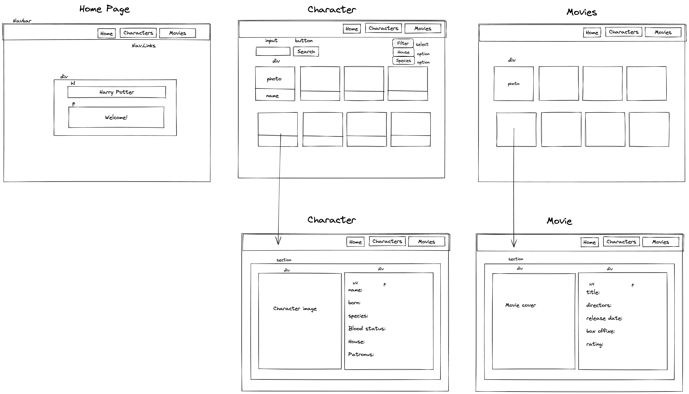
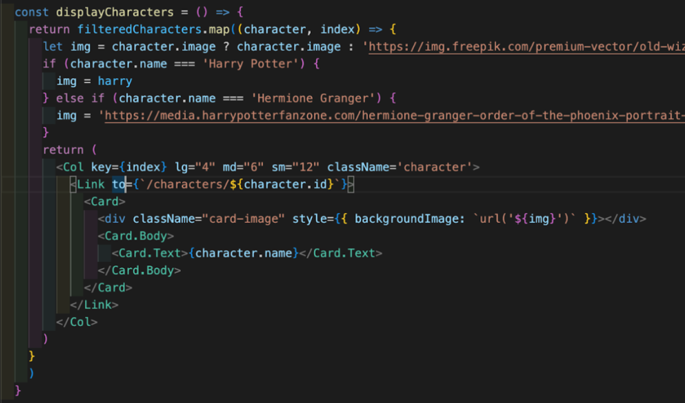
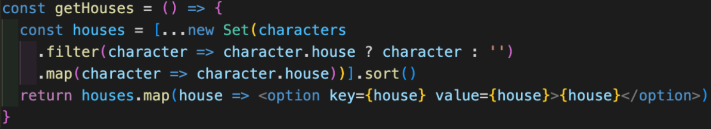
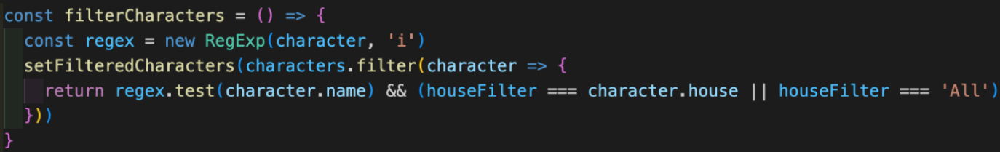
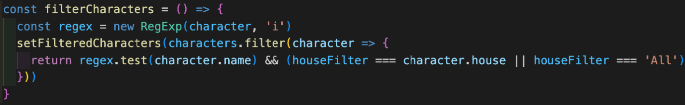
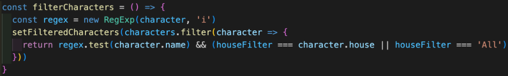

# Harry Potter React App ReadMe

## Description
For this project, I was required to build a React application that consumes a third-party API.

## Deployment Link
https://harry-potter-react-project.netlify.app/

## Timeframe & Working Team
We were presented with the project brief at 14:00 on Wednesday 8th March 2023 and had until 15:00 on Friday 10th March 2023 to complete it. We were required to complete this project with a randomly assigned partner.

## Technologies Used
JavaScript/JSX
React
SCSS/CSS
Bootstrap
HTML
Visual Studio Code
GitHub
Netlify
Excalidraw

## Brief
### Overview:
Build a React application that consumes a public API.

### Technical Requirements:
Your app must:
Consume a public API - this could be anything but it must make sense for your project.
Have several components
The app can have a router - with several “pages”, this is up to you and if it makes sense for your project
Include wireframes - that you designed before building the app.
Be deployed online and accessible to the public (hosted on your public GitHub)

## Planning
The first task we undertook was creating a wireframe using Excalidraw. Wireframes play a crucial role in the planning process, as they enable us to carefully consider the structure of the page. Please refer to the screenshot below, which showcases the wireframe we developed for this application.

We planned that the application would open on a landing page, featuring a top navigation bar containing links to the character and movie pages. The characters page would include a search bar and filters positioned above character cards, which would display images and names. By clicking on a character's card, the user would be directed to a more comprehensive biography of that character. The movies page would have a similar layout, but without the search bar and filters.

We agreed to collaborate on all aspects of this project, with me taking the responsibility of writing the code while sharing my screen.

## Build Process
The initial step we took was to create a BrowserRouter component in the App.js file. This component would serve as the container for the Routes leading to other components.

Next, our focus shifted to developing the Characters functional component. This component's purpose was to showcase a picture and name for each Harry Potter character, which we obtained from the chosen API endpoint. The Characters page would include a search bar, a dropdown menu for filtering characters by house, and the character cards themselves.

To accomplish this, we utilised React hooks, such as useEffect, in combination with Axios, to fetch data from the API endpoint. We also utilised useState to define state variables necessary for displaying the character data on the page.

Additionally, we implemented the displayCharacters function, which employed the map method on the filteredCharacters array. For each character, the function returns a Card component, complete with a Link leading to the CharacterSingle component. See below, the code for the displayCharacters function.

To generate a dynamic list of houses for the dropdown, we utilised the filter and map methods. These allowed us to extract all the houses from the character data and create a corresponding list. To ensure uniqueness, we employed a Set constructor to create a new set consisting of only unique houses. Finally, by utilising the spread operator, we converted the set back into an array. Please refer to the code snippet below:

The component also includes the filterCharacters function, which is responsible for filtering the characters displayed on the page based on the search query and/or house selection. See below, the code for the filterCharacters function.

The next logical step was to create the Movies component at this stage, as its layout and functionality were expected to be very similar to the Characters component.

We utilised a similar function to import the movie data, with the only changes being the API endpoint and further data deconstruction specific to movies. The function responsible for displaying the movies resembled the `displayCharacters` function, with the exception that we needed to filter out the Fantastic Beasts movies since they were included in the API endpoint but not required for our app.

Subsequently, we developed the PageNavbar component, which would serve as the site's navigation tool. To achieve this, we used the Navbar component from React Bootstrap, ensuring responsiveness by implementing Navbar.Toggle and Navbar.Collapse.

Within the Navbar component, we utilised the Link component from React Router Dom to create links leading to the Home, Characters, and Movies pages.

Moving on, we focused on the CharacterSingle component. This page displayed more detailed character information and was accessible through the character cards on the Characters component. Since the API did not provide specific endpoints for individual characters, we again employed the useEffect and Axios to fetch data from the API endpoint.

The CharacterSingle component started by extracting the `id` parameter from the URL using the useParams hook. We used this `id` to filter the array of characters returned from the API, finding the character with the corresponding ID. We then mapped over the filtered array to display the desired character details.

Lastly, we created the Error, Loading, and PageNotFound components, which were designed for global use on the site. These components would be displayed during data loading, waiting periods, or when a requested page did not exist.

## Challenges
While working on the project, we encountered several challenges that required our attention and problem-solving skills. Firstly, we struggled to find a suitable API that provided sufficient data for our needs. Eventually, we settled on an API that only had a single endpoint for characters. To address this limitation, we had to search for a second API endpoint specifically for movie data. Integrating and coordinating the two endpoints added complexity to the project and required additional effort to ensure seamless functionality between them.

Another challenge we faced was the poor quality of some images provided by the API. To maintain a professional appearance in our application, we had to manually search for better quality images to replace the inadequate ones. Although this process was time-consuming, it was necessary to ensure an appealing visual experience for our users.

One of the more interesting challenges we encountered involved implementing seamless interaction between the search and dropdown filters. To overcome this, we utilised a second React state called filteredCharacters in addition to the existing characters state. By employing this approach, we were able to filter the characters based on both the search query and the dropdown filter, thereby delivering a smooth user experience. Please refer to the code snippet below for an example of this implementation:

Finally, working in a pair brought certain project management challenges that I believe we handled well. We prioritised regular communication and collaborative work to ensure that everyone was aligned and that we were making progress towards our goals. Additionally, we established a routine of regularly reviewing our code and providing feedback to each other, ensuring the robustness of our code.

## Wins
Overall, I am pleased with the overall aesthetics of the site and our successful implementation of filters that work harmoniously together. The code snippet showcasing this functionality is provided below.

## Key Takeaways
During this project, I had the valuable opportunity to collaborate with a partner and develop an app together, which emphasised the significance of effective communication. This experience provided me with valuable insights into the importance of clear and consistent communication within a team setting.

Furthermore, this project introduced me to new technologies such as React, Bootstrap, and SCSS. As I worked with these technologies, my confidence in utilising React's useEffect and useState hooks grew, allowing me to effectively manage component lifecycles and state management.

Additionally, this project allowed me to integrate external APIs into my work for the first time. This experience deepened my understanding of React's useEffect hook, as well as Axios and promise-based requests. It also highlighted the importance of carefully selecting suitable APIs, taking into account factors such as data quality and accessibility within the API.

## Bugs
The PageNotFound does not capture all invalid paths.

## Future Improvements
If we had more time, one aspect I would prioritise is addressing the bug we encountered earlier, where the PageNotFound component does not display for all invalid paths. Resolving this issue would help enhance the user experience and provide a consistent response for any incorrect or invalid URLs.

Additionally, I wanted to explore the possibility of utilising an alternative API to fetch photos for characters who were missing them at our primary API endpoint.
